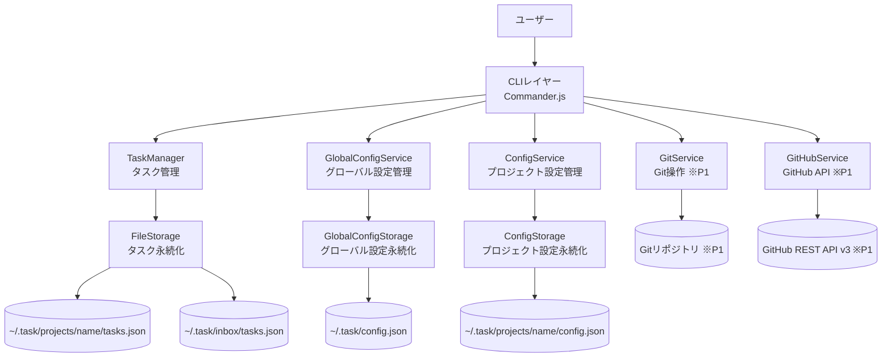
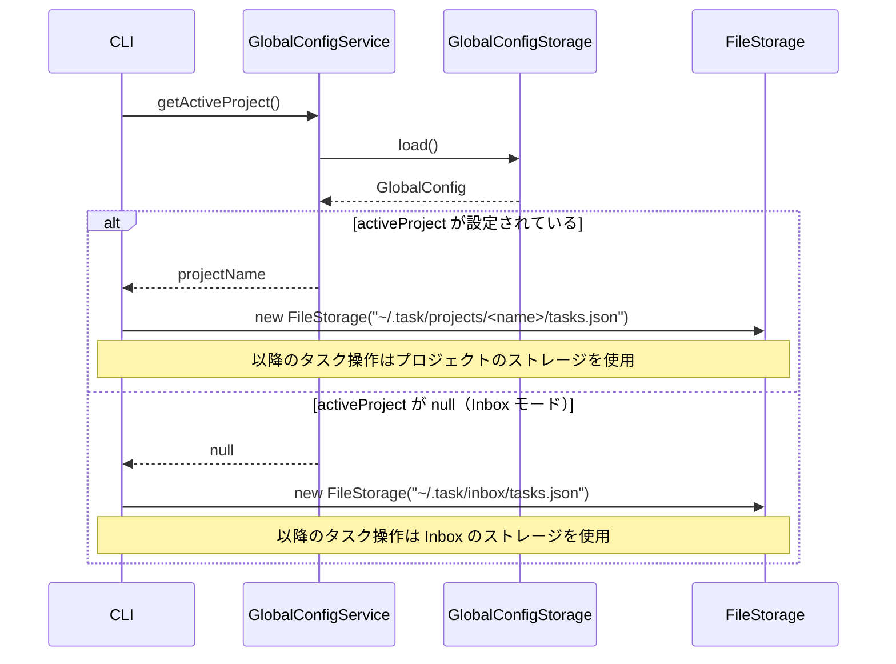
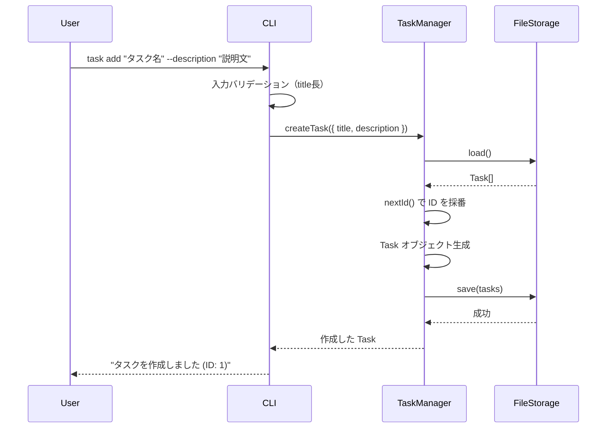
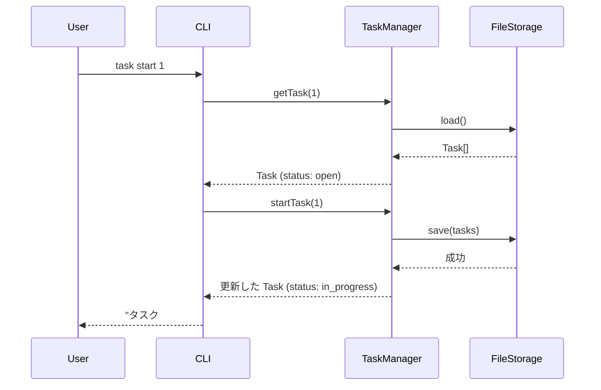
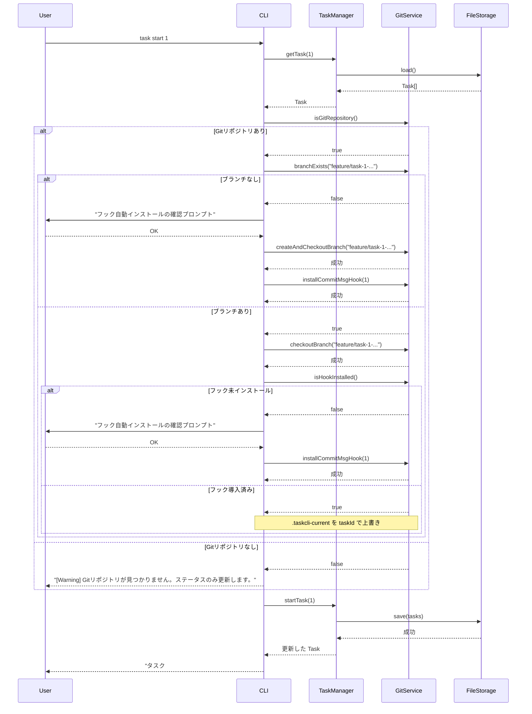
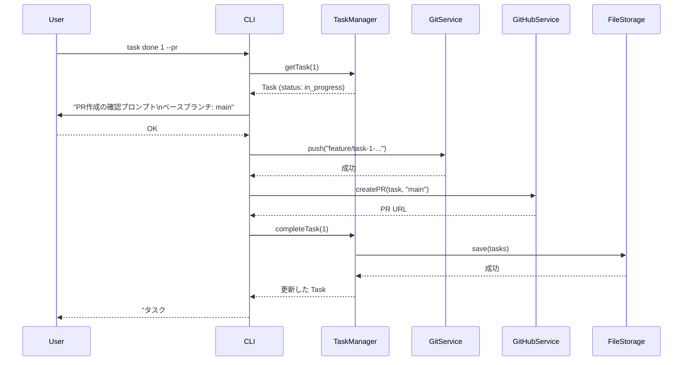
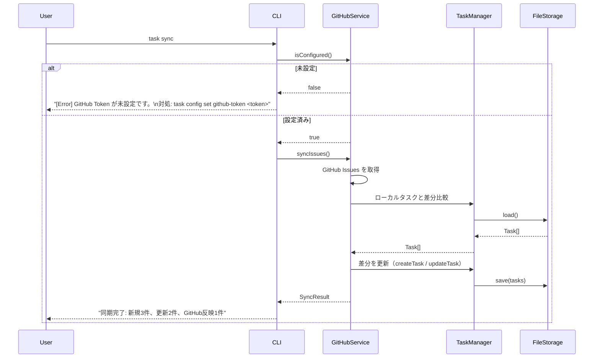
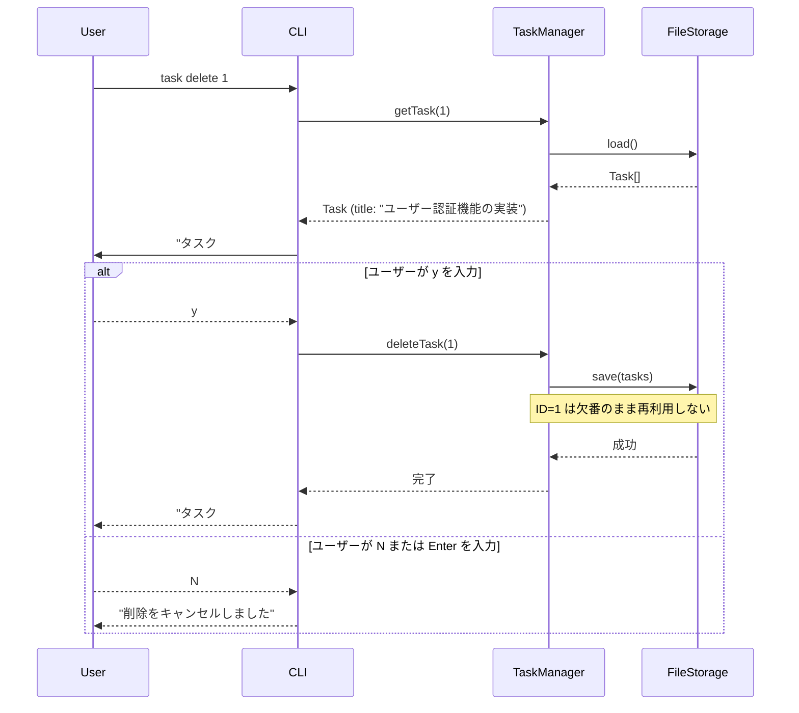

# 機能設計書 (Functional Design Document)

## 対象バージョン

| バージョン | 対象機能 |
|-----------|---------|
| v1.0 MVP（P0） | タスク基本操作・Inbox・プロジェクト管理・ステータス管理・テーブル表示 |
| v1.1（P1） | Git ブランチ自動連携・コミット自動タグ付け・絞り込み・検索・タスク編集・優先度/期限管理・GitHub Issues 連携・PR 自動作成 |

※ P2（チーム機能・作業時間記録・テンプレート・カレンダー）は本設計書の対象外。

---

## システム構成図



---

## 技術スタック

| 分類 | 技術 | 選定理由 |
|------|------|----------|
| 言語 | TypeScript 5.x | 型安全性・補完による開発効率向上 |
| CLIフレームワーク | Commander.js | 学習コストが低く、機能が十分 |
| Git操作 | simple-git | Node.jsからGit操作を抽象化するデファクトライブラリ |
| GitHub連携 | GitHub REST API v3 | PAT認証で手軽に利用可能 |
| テスト | Vitest | TypeScriptネイティブ対応、高速 |
| パッケージマネージャー | npm | プロジェクト標準 |
| ランタイム | Node.js v20以上 | v18 は EOL のため v20 LTS 以上を必須とする。開発環境は v24.11.0 を使用。 |

---

## データモデル定義

### エンティティ: Task

```typescript
type TaskStatus = 'open' | 'in_progress' | 'completed' | 'archived';
type TaskPriority = 'high' | 'medium' | 'low';

interface Task {
  id: number;              // 自動採番（1始まり、欠番は再利用しない）
  title: string;           // タスク名（1〜200文字）
  description: string;     // 詳細説明（Markdown可、デフォルト空文字）
  status: TaskStatus;      // ステータス（デフォルト: 'open'）
  priority: TaskPriority;  // 優先度（デフォルト: 'medium'）
  branch: string | null;   // 紐付いたGitブランチ名（task start時に設定）
  dueDate: string | null;  // 期限（YYYY-MM-DD形式）
  createdAt: string;       // 作成日時（ISO 8601形式）
  updatedAt: string;       // 最終更新日時（ISO 8601形式）
}
```

**制約**:
- `id`: 正の整数。削除しても欠番のまま再利用しない
- `title`: 必須、1〜200文字
- `status`: `'open'` → `'in_progress'` → `'completed'` の一方向遷移。`'archived'` へは `'open'` または `'completed'` からのみ遷移可能（`'in_progress'` → `'archived'` は不可）
- `dueDate`: `YYYY-MM-DD` 形式。不正な日付は受け付けない

### エンティティ: GlobalConfig

グローバル設定（`~/.task/config.json`）。ユーザー全体に共通する設定を管理する。

```typescript
interface GlobalConfig {
  activeProject: string | null;  // アクティブプロジェクト名（null = Inbox モード）
}
```

### エンティティ: ProjectConfig

プロジェクト別設定（`~/.task/projects/<name>/config.json`）。※ P1 で利用する GitHub 連携設定。

```typescript
interface ProjectConfig {
  githubToken: string | null;  // GitHub Personal Access Token（P1）
  githubOwner: string | null;  // GitHubリポジトリのオーナー名（P1）
  githubRepo: string | null;   // GitHubリポジトリ名（P1）
  defaultBranch: string;       // デフォルトベースブランチ（P1、デフォルト: 'main'）
}
```

### ファイル構造

```
~/.task/
├── config.json                    # グローバル設定（activeProject 等）
├── inbox/
│   └── tasks.json                 # Inbox タスクデータ（配列）
└── projects/
    └── <name>/
        ├── tasks.json             # タスクデータ（配列）
        └── config.json            # プロジェクト別設定（GitHub Token 等、chmod 600、P1）
```

**~/.task/config.json の例**:
```json
{
  "activeProject": "my-app"
}
```

**~/.task/projects/my-app/tasks.json の例**:
```json
[
  {
    "id": 1,
    "title": "ユーザー認証機能の実装",
    "description": "JWT を使ったログイン・ログアウト機能",
    "status": "in_progress",
    "priority": "high",
    "branch": "feature/task-1-user-authentication",
    "dueDate": "2026-03-31",
    "createdAt": "2026-02-26T10:00:00Z",
    "updatedAt": "2026-02-26T11:30:00Z"
  }
]
```

**~/.task/projects/my-app/config.json の例（P1）**:
```json
{
  "githubToken": null,
  "githubOwner": null,
  "githubRepo": null,
  "defaultBranch": "main"
}
```

---

## コンポーネント設計

### CLIレイヤー (`src/cli/`)

**責務**: コマンド解析・入力バリデーション・結果の整形表示

```typescript
// src/cli/index.ts - エントリーポイント
// Commander.js でサブコマンドを登録し、各サービスに委譲する

class CLI {
  registerCommands(): void;   // 全サブコマンドを登録
  run(argv: string[]): void;  // CLI起動
}
```

**サブコマンド一覧（P0: v1.0 MVP）**:

| コマンド | 引数 / オプション | 処理概要 |
|---------|----------------|---------|
| `task add <title>` | `--description` | タスク作成 |
| `task list` | `--status <status>`, `--inbox` | タスク一覧表示（`--status` でステータス絞り込み、`--inbox` で inbox のタスクを表示） |
| `task show <id>` | — | タスク詳細表示 |
| `task start <id>` | — | ステータスを `in_progress` に変更 |
| `task done <id>` | — | ステータスを `completed` に変更 |
| `task delete <id>` | — | タスク削除（確認プロンプト付き） |
| `task archive <id>` | — | ステータスを `archived` に変更 |
| `task project create <name>` | — | プロジェクト作成 |
| `task project list` | — | プロジェクト一覧表示（タスク数付き） |
| `task project use <name>` | — | アクティブプロジェクトを切り替え |
| `task project remove <name>` | — | プロジェクト削除（確認プロンプト付き） |
| `task move <id> <project>` | — | タスクを別プロジェクト（または `inbox`）に移動 |
| `task inbox` | — | アクティブプロジェクトを解除し Inbox モードに切り替え |

**サブコマンド一覧（P1: v1.1）**:

| コマンド | 引数 / オプション | 処理概要 |
|---------|----------------|---------|
| `task add <title>` | `--priority`, `--due` | P0 に優先度・期限オプション追加 |
| `task list` | `--priority`, `--sort` | P0 の `--status` / `--inbox` に加え、優先度絞り込み・ソートを追加 |
| `task start <id>` | — | ステータス変更 + Git ブランチ作成 + コミットフックインストール |
| `task done <id>` | `--pr` | ステータス変更（`--pr` で PR 作成） |
| `task edit <id>` | — | タスク属性の編集 |
| `task search <keyword>` | — | タイトル・説明の全文検索 |
| `task config setup` | — | 対話式ウィザードで GitHub Token・Owner・Repo を一括設定 |
| `task config set <key> <value>` | — | プロジェクト別設定値を個別保存（GitHub Token 等） |
| `task sync` | — | GitHub Issues と双方向同期 |
| `task import --github` | — | GitHub Issues からインポート |

---

### TaskManager (`src/services/TaskManager.ts`)

**責務**: タスクのCRUDおよびステータス管理

```typescript
class TaskManager {
  createTask(data: CreateTaskInput): Task;
  listTasks(filter?: TaskFilter): Task[];
  getTask(id: number): Task;
  updateTask(id: number, data: Partial<Task>): Task;
  deleteTask(id: number): void;
  startTask(id: number): Task;      // open/in_progress → in_progress
  completeTask(id: number): Task;   // in_progress → completed
  archiveTask(id: number): Task;    // open/completed → archived
  // title・description を対象に、大文字小文字を区別しない部分一致検索
  // 例: searchTasks("auth") → "auth"/"Auth"/"AUTH" を含む Task[] を返す
  searchTasks(keyword: string): Task[];
  nextId(): number;                 // 現在の最大IDに+1した値を返す
}

interface CreateTaskInput {
  title: string;
  description?: string;
  priority?: TaskPriority;
  dueDate?: string;
}

interface TaskFilter {
  status?: TaskStatus;
  priority?: TaskPriority;
  sort?: 'id' | 'priority' | 'dueDate' | 'createdAt';
  // デフォルトは 'id' の昇順。'priority' はhigh > medium > lowの順。
  // 'dueDate' はnullを末尾に表示。
}
```

**依存関係**: `FileStorage`

---

### GitService (`src/services/GitService.ts`)

**責務**: Gitブランチ操作・コミットフック管理

```typescript
class GitService {
  isGitRepository(): Promise<boolean>;
  getCurrentBranch(): Promise<string>;
  createAndCheckoutBranch(branchName: string): Promise<void>;
  checkoutBranch(branchName: string): Promise<void>;
  branchExists(branchName: string): Promise<boolean>;
  installCommitMsgHook(taskId: number): Promise<void>;  // prepare-commit-msg フックをインストール
  push(branch: string): Promise<void>;
  formatBranchName(taskId: number, title: string): string;
  // 例: formatBranchName(1, "ユーザー認証機能の実装") → "feature/task-1-user-authentication"
  // 内部実装: src/utils/slug.ts の slugify() を使用
}
```

**依存関係**: `simple-git`

**ブランチ命名規則**:
- フォーマット: `feature/task-<id>-<slug>`
- スラッグ変換: タイトルを小文字英数字+ハイフンに変換。非 ASCII 文字（日本語等）は除去。連続するハイフンは 1 つに圧縮。先頭・末尾のハイフンも除去。
- 最大長: 63文字（超過時は切り詰め）
- スラッグが空になる場合（タイトルが全角文字のみ等）は `task-<id>` のみとする

**スラッグ変換例**:

| 入力タイトル | 変換後スラッグ |
|-----------|-------------|
| `"ユーザー認証機能の実装"` | `""` → ブランチ名: `feature/task-1` |
| `"Fix: Login Bug #123"` | `"fix-login-bug-123"` |
| `"Add OAuth 2.0 Support"` | `"add-oauth-2-0-support"` |
| `"user authentication"` | `"user-authentication"` |

**コミットフック仕様** (`.git/hooks/prepare-commit-msg`)（P1）:
```bash
#!/bin/sh
# TaskCLI: auto-append task number
TASK_ID=$(cat "$(git rev-parse --show-toplevel)/.taskcli-current" 2>/dev/null)
if [ -n "$TASK_ID" ]; then
  echo "" >> "$1"
  echo "[Task #$TASK_ID]" >> "$1"
fi
```
- `task start <id>` 実行時に Git リポジトリルートの `.taskcli-current` にタスクIDを保存（P1）
- `task done <id>` 実行時に `.taskcli-current` を削除（P1）
- `.taskcli-current` は `.gitignore` に追加する（P1）

---

### GitHubService (`src/services/GitHubService.ts`)

**責務**: GitHub Issues の同期・PR作成

```typescript
class GitHubService {
  createPR(task: Task, baseBranch: string): Promise<string>;  // PR URL を返す
  syncIssues(): Promise<SyncResult>;
  importIssues(): Promise<Task[]>;
  isConfigured(): boolean;
}

interface SyncResult {
  created: number;   // ローカルに新規作成したタスク数
  updated: number;   // 更新したタスク数
  pushed: number;    // GitHub Issues に反映したタスク数
}
```

**PR 本文テンプレート**:
```markdown
## 概要
{task.description が空でなければ記載。空の場合は「{task.title} の実装」}

## 関連タスク
Task #{task.id}
```

**依存関係**: `ConfigService`, `node-fetch` または Node.js 標準 `fetch`

---

### GlobalConfigService (`src/services/GlobalConfigService.ts`)

**責務**: グローバル設定（`~/.task/config.json`）の読み書き・アクティブプロジェクト管理

```typescript
class GlobalConfigService {
  getActiveProject(): string | null;         // アクティブプロジェクト名。null = Inbox モード
  setActiveProject(name: string | null): void;  // null を渡すと Inbox モードに切り替え
  getAll(): GlobalConfig;
}
```

**依存関係**: `GlobalConfigStorage`

---

### ConfigService (`src/services/ConfigService.ts`)

**責務**: プロジェクト別設定（`~/.task/projects/<name>/config.json`）の読み書き・バリデーション（P1）

```typescript
class ConfigService {
  get<K extends keyof ProjectConfig>(key: K): ProjectConfig[K];
  set<K extends keyof ProjectConfig>(key: K, value: ProjectConfig[K]): void;  // バリデーション後に保存
  getAll(): ProjectConfig;
}
```

**バリデーション仕様**（P1）:

| キー | バリデーション |
|-----|-------------|
| `githubToken` | `ghp_` または `github_pat_` で始まる文字列。形式が不正な場合は警告を表示して保存（APIエラーはsync/PR作成時に検出） |
| `githubOwner` | 英数字・ハイフンのみ（GitHub ユーザー名規則）。空文字は不可 |
| `githubRepo` | 英数字・ハイフン・アンダースコア・ドットのみ。空文字は不可 |
| `defaultBranch` | 空文字は不可。デフォルト値: `'main'` |

**依存関係**: `ConfigStorage`

---

### GlobalConfigStorage (`src/storage/GlobalConfigStorage.ts`)

**責務**: `~/.task/config.json` の読み書き

```typescript
class GlobalConfigStorage {
  load(): GlobalConfig;
  save(config: GlobalConfig): void;
  ensureDirectory(): void;  // ~/.task/ ディレクトリを作成
}
```

**デフォルト値**: `activeProject: null`（初回起動時は Inbox モード）

---

### FileStorage (`src/storage/FileStorage.ts`)

**責務**: タスクデータ（`~/.task/projects/<name>/tasks.json` または `~/.task/inbox/tasks.json`）の読み書き・バックアップ

ストレージパスはコンストラクタで受け取り、GlobalConfigService が解決したアクティブプロジェクトに基づいて CLI 層から渡す。

```typescript
class FileStorage {
  constructor(filePath: string) {}  // 例: "~/.task/projects/my-app/tasks.json"
  load(): Task[];
  save(tasks: Task[]): void;        // 書き込み前にバックアップを作成
  ensureDirectory(): void;          // 親ディレクトリ（~/.task/projects/<name>/）を作成
}
```

**書き込みフロー**:
1. 現在の `tasks.json` を `tasks.json.bak` にコピー
2. 新データを `tasks.json` に書き込み
3. 成功したら `.bak` を削除（失敗したら `.bak` を復元）

---

### ConfigStorage (`src/storage/ConfigStorage.ts`)

**責務**: `~/.task/projects/<name>/config.json` の読み書き（P1）

```typescript
class ConfigStorage {
  constructor(filePath: string) {}  // 例: "~/.task/projects/my-app/config.json"
  load(): ProjectConfig;
  save(config: ProjectConfig): void;  // ファイルパーミッションを 600 に設定
}
```

---

### Renderer (`src/cli/Renderer.ts`)

**責務**: タスク一覧・詳細のターミナル表示

```typescript
class Renderer {
  renderTable(tasks: Task[]): void;
  renderDetail(task: Task): void;
  renderSuccess(message: string): void;
  renderError(error: AppError): void;
}
```

---

## ユースケース図

### UC-0: アクティブプロジェクト解決フロー

すべてのコマンド実行前に共通で走るフロー。タスクの保存先（プロジェクトまたは Inbox）を決定する。



**ヘッダー表示ルール**（`task list` 実行時）:
- アクティブプロジェクトあり → `[Project: <name>]`
- Inbox モード → `[Inbox]`

---

### UC-1: task add（タスク作成）



---

### UC-2: task start（タスク開始）

#### P0: ステータス変更のみ（v1.0 MVP）



**Inbox モードでの動作**: Inbox のタスクに `task start` を実行した場合、ステータスは `in_progress` に更新するが、「プロジェクトに移動してから Git 連携を使用してください（P1）」という情報メッセージを合わせて表示する。

#### P1: Git ブランチ作成 + コミットフックインストール（v1.1）



---

### UC-3: task done --pr（タスク完了 + PR作成）



---

### UC-4: task sync（GitHub Issues 同期）



---

### UC-5: task delete（タスク削除）



---

## UI設計（ターミナル表示）

### task list のテーブル表示

**P0（v1.0 MVP）表示**:
```
[Project: my-app]
 ID  Status       Title
 ─── ──────────── ────────────────────────────────────────
  1  in_progress  ユーザー認証機能の実装
  2  open         データエクスポート機能
  3  completed    初期セットアップ

[Inbox]  ← アクティブプロジェクト未設定時
 ID  Status       Title
 ─── ──────────── ────────────────────────────────────────
  1  open         買い物リスト作成
```

**P1（v1.1）追加列**:
```
[Project: my-app]
 ID  Status       Priority  Title                            Branch                              Due
 ─── ──────────── ──────── ──────────────────────────────── ─────────────────────────────────── ──────────
  1  in_progress  high      ユーザー認証機能の実装            feature/task-1-user-authentication  2026-03-31
  2  open         medium    データエクスポート機能             -                                   -
  3  completed    low       初期セットアップ                   feature/task-3-initial-setup        -
```

**表示項目**:
| 列 | バージョン | 説明 | フォーマット |
|---|---|---|---|
| ヘッダー行 | P0 | `[Project: <name>]` または `[Inbox]` | テーブル上部に常時表示 |
| ID | P0 | タスクID | 右寄せ数値 |
| Status | P0 | ステータス | カラーコード付き文字列 |
| Title | P0 | タスク名 | 最大40文字（超過は`…`で省略） |
| Priority | P1 | 優先度 | カラーコード付き文字列 |
| Branch | P1 | ブランチ名 | 最大35文字（超過は`…`で省略）、なければ `-` |
| Due | P1 | 期限 | `YYYY-MM-DD`、なければ `-`、期限切れは赤 |

### task project list の表示

```
* my-app     5 tasks (2 in_progress)    ← * はアクティブプロジェクト
  personal   3 tasks (0 in_progress)
─────────────────────────────────────
  [Inbox]    1 task
```

- アクティブプロジェクトは `*` で強調表示
- 各プロジェクトのタスク総数と `in_progress` 件数を表示
- Inbox のタスク数をフッターに表示

---

### カラーコーディング

**ステータスの色分け**:
- `open`: 白
- `in_progress`: 黄
- `completed`: 緑
- `archived`: グレー

**優先度の色分け（task show での表示）**:
- `high`: 赤
- `medium`: 黄
- `low`: 青

**期限の色分け**:
- 期限切れ（今日以前）: 赤
- 残り 3 日以内: 黄
- それ以外: デフォルト色

---

## エラーハンドリング

### エラークラス設計

```typescript
class AppError extends Error {
  constructor(
    message: string,
    public readonly cause: string,
    public readonly remedy: string
  ) {
    super(message);
  }
}
```

### エラー表示フォーマット

```
[Error] <エラーの概要>
  原因: <なぜ失敗したか>
  対処: <ユーザーが取るべき操作>
```

### エラー種別一覧

| エラー種別 | 処理 | 表示例 |
|-----------|------|-------|
| 入力バリデーション | 処理を中断 | `[Error] タイトルが長すぎます。\n  原因: 201文字以上の入力は受け付けません。\n  対処: 200文字以内で入力してください。` |
| タスクが見つからない | 処理を中断 | `[Error] タスクが見つかりません。\n  原因: ID=99 のタスクは存在しません。\n  対処: task list で有効なIDを確認してください。` |
| 不正なステータス遷移 | 処理を中断 | `[Error] このタスクは開始できません。\n  原因: archived のタスクは変更できません。\n  対処: 新しいタスクを作成してください。` |
| Gitリポジトリなし | ブランチ操作をスキップ、警告表示 | `[Warning] Gitリポジトリが見つかりません。ステータスのみ更新します。` |
| Gitブランチ操作失敗 | 元のブランチに戻す、処理を中断 | `[Error] ブランチの作成に失敗しました。\n  原因: <git エラーメッセージ>\n  対処: git status を確認し、未コミットの変更を解消してください。` |
| GitHub Token 未設定 | 処理を中断 | `[Error] GitHub Token が未設定です。\n  原因: GitHub 連携機能には設定が必要です。\n  対処: task config set github-token <token> で設定してください。` |
| GitHub API エラー | 処理を中断 | `[Error] GitHub API リクエストが失敗しました。\n  原因: <HTTPステータスコード> <メッセージ>\n  対処: Token の権限と有効期限を確認してください。` |
| ネットワークタイムアウト | 処理を中断 | `[Error] ネットワークタイムアウト（5秒）が発生しました。\n  原因: GitHub API に接続できません。\n  対処: インターネット接続を確認してください。` |
| Inbox タスクへの `task start`（P1 機能の案内） | ステータスのみ更新、情報メッセージ表示 | `[Info] タスク #1 を開始しました。Git 連携（P1）を使用する場合は task move 1 <project> でプロジェクトに移動してください。` |
| ファイル読み込み失敗 | 空データで初期化し継続 | `[Warning] タスクデータが見つかりません。新規作成します。` |
| ファイル書き込み失敗 | .bak から復元し処理中断 | `[Error] タスクデータの保存に失敗しました。\n  原因: ディスクの空き容量が不足している可能性があります。\n  対処: ディスク容量を確認してください。` |

---

## パフォーマンス設計

- **JSONファイルの全件読み込み**: 1 コマンド実行あたり 1 回のみ `load()` を呼ぶ。複数回 I/O しない
- **検索**: `Array.prototype.filter` + 文字列 `includes` で十分（最大 10,000 件でも数ミリ秒以内）
- **タイムアウト**: GitHub API 呼び出しには `AbortController` で 5 秒のタイムアウトを設定
- **バックアップ**: 書き込み時のみ `.bak` を作成し、完了後即削除。常時 2 ファイル以上保持しない

---

## セキュリティ設計

- **`~/.task/` のパーミッション**: `GlobalConfigStorage.ensureDirectory()` 実行時に `fs.chmodSync("~/.task/", 0o700)` を設定し、オーナーのみアクセス可能にする
- **プロジェクト設定ファイルのパーミッション（P1）**: `ConfigStorage.save()` 後に `fs.chmodSync(path, 0o600)` を実行し、オーナーのみ読み書き可能にする（`~/.task/projects/<name>/config.json` に GitHub Token を格納するため）
- **`.taskcli-current` の `.gitignore` 追加（P1）**: `task start` 実行時に Git リポジトリルートの `.gitignore` に `.taskcli-current` を追記するか確認プロンプトを表示する
- **コマンドインジェクション防止（P1）**: `simple-git` の API を使用し、シェルコマンドの文字列結合を行わない。GitHub API リクエストのパラメータは `encodeURIComponent` でエスケープする

---

## テスト戦略

### ユニットテスト（`src/**/*.test.ts`）

- `TaskManager`: 各メソッドの正常系・異常系（ステータス遷移違反、ID不存在など）
- `GitService`: `formatBranchName` のスラッグ変換ロジック
- `FileStorage`: バックアップ・リストアのロジック（モックファイルシステム使用）
- `Renderer`: 期限切れ・長タイトルのトリミングなど表示ロジック

### 統合テスト

- `task add` → `task start` → `task done` の一連のフロー（実際のファイル I/O を使用）
- `FileStorage` のバックアップ復元（書き込み途中でのクラッシュをシミュレート）

### E2Eテスト（手動）

- Gitリポジトリありの環境で `task start` → ブランチ自動作成を確認
- Gitリポジトリなしの環境で `task start` → 警告表示のみでクラッシュしないことを確認
- `task done --pr` での PR 作成（テスト用 GitHub リポジトリを使用）
