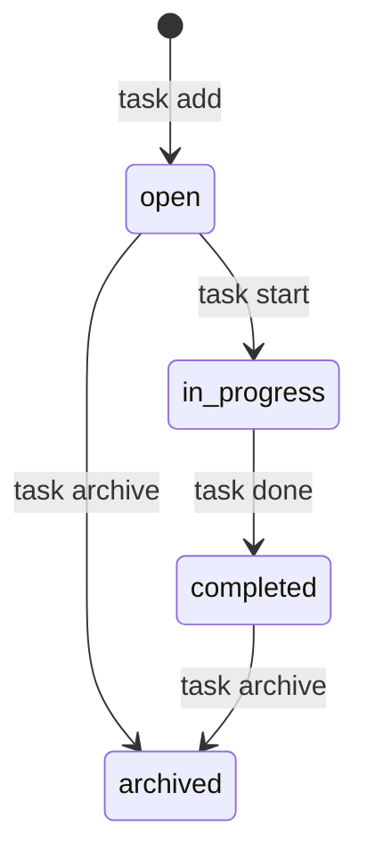

# プロジェクト用語集 (Glossary)

## 概要

このドキュメントは、TaskCLI プロジェクト内で使用される用語を統一的に定義します。
新しいメンバーのオンボーディングや、ドキュメント・コード間での用語の一貫性維持に使用してください。

**更新日**: 2026-02-22

---

## ドメイン用語

### プロジェクト (Project)

**定義**: TaskCLI を使用する作業ディレクトリ。`.task/` ディレクトリが存在する場所。

**説明**: `git init` と同じ「作業ディレクトリ単位」の概念。プロジェクトをまたいでタスクは共有されない。

**関係**:
- 1プロジェクト = 1タスクの集合（`.task/tasks.json`）
- 1プロジェクト = 最大1つの GitHub リポジトリ（未設定でも使用可能）

```
~/project-a/  →  .task/tasks.json  (タスク集合A)  ←→  GitHub: org/project-a
~/project-b/  →  .task/tasks.json  (タスク集合B)  ←→  （未設定・ローカル単独）
```

---

### タスク (Task)

**定義**: ユーザーが完了すべき作業の単位。

**説明**: TaskCLI が管理する中心的なエンティティ。タイトル・説明・ステータス・優先度・期限・紐付きブランチを持つ。`task add` コマンドで作成され、`task done` で完了に遷移する。

**関連用語**:
- [タスクステータス](#タスクステータス-task-status): タスクの進行状態
- [タスク優先度](#タスク優先度-task-priority): タスクの重要度
- [作業中タスク](#作業中タスク-current-task): 現在 `task start` で開始中のタスク

**使用例**:
- 「タスクを追加する」: `task add "実装内容"` を実行してタスクを作成する
- 「タスクを開始する」: `task start <id>` を実行してステータスを `in_progress` に変更する

**データモデル**: `src/types/index.ts`

**英語表記**: Task

---

### タスクステータス (Task Status)

**定義**: タスクの進行状態を示す 4 段階の値。

**取りうる値**:

| 値 | 日本語 | 意味 | コマンド |
|---|--------|------|---------|
| `open` | 未着手 | タスク作成直後の初期状態 | `task add` で設定 |
| `in_progress` | 進行中 | 現在作業中の状態 | `task start <id>` で遷移 |
| `completed` | 完了 | 作業が終わった状態 | `task done <id>` で遷移 |
| `archived` | アーカイブ済み | 参照用に残す非アクティブな状態 | `task archive <id>` で遷移 |

**状態遷移図**:


**ビジネスルール**:
- 逆方向の遷移（再オープン）は MVP スコープ外
- `archived` からの遷移は不可
- `in_progress` → `archived` への直接遷移は不可（`task done` で `completed` に遷移してから `task archive` を使用する）

**実装**: `src/types/index.ts`（`type TaskStatus`）、`src/services/TaskManager.ts`

---

### タスク優先度 (Task Priority)

**定義**: タスクの重要度・緊急度を示す 3 段階の値。

**取りうる値**:

| 値 | 日本語 | 意味 |
|---|--------|------|
| `high` | 高 | 即座に対応が必要な緊急タスク |
| `medium` | 中 | 計画的に対応すべき重要タスク（デフォルト） |
| `low` | 低 | 時間があれば対応するタスク |

**使用例**:
```bash
task add "セキュリティ脆弱性の修正" --priority high
task list --sort priority  # high → medium → low の順で表示
```

**実装**: `src/types/index.ts`（`type TaskPriority`）

---

### ブランチスラッグ (Branch Slug)

**定義**: タスクのタイトルをブランチ名に使用できる形式に変換した文字列。

**変換ルール**: 英小文字・数字・ハイフンのみ。非 ASCII 文字（日本語等）は除去。連続するハイフンは 1 つに圧縮。最大 63 文字。

**変換例**:

| 入力タイトル | ブランチスラッグ | ブランチ名 |
|-----------|-------------|---------|
| `"Fix: Login Bug #123"` | `fix-login-bug-123` | `feature/task-1-fix-login-bug-123` |
| `"Add OAuth 2.0 Support"` | `add-oauth-2-0-support` | `feature/task-2-add-oauth-2-0-support` |
| `"ユーザー認証機能の実装"` | `""`（空） | `feature/task-3` |

**実装**: `src/utils/slug.ts`（`formatBranchName`）

---

### 作業中タスク (Current Task)

**定義**: `task start <id>` で開始された、現在進行中のタスク。

**説明**: `task start` 実行時に `.task/.current-task` ファイルにタスク ID が保存される。Git の `prepare-commit-msg` フックがこのファイルを参照し、コミットメッセージに `[Task #<id>]` を自動付与する。`task done` 実行時に削除される。

**関連用語**:
- [コミット自動タグ付け](#コミット自動タグ付け-commit-auto-tagging)

**ファイルパス**: `.task/.current-task`

---

### コミット自動タグ付け (Commit Auto-tagging)

**定義**: `task start` 後の `git commit` 時に、コミットメッセージ末尾へ `[Task #<id>]` を自動付与する機能。

**説明**: `task start <id>` 実行時に `.git/hooks/prepare-commit-msg` フックがインストールされる。フックは `.task/.current-task` を読み込み、ID をコミットメッセージに追記する。

**使用例**:
```bash
task start 5
git commit -m "feat(cli): --sort オプションを追加"
# → 実際のコミットメッセージ:
# feat(cli): --sort オプションを追加
#
# [Task #5]
```

**実装**: `src/services/GitService.ts`（`installCommitMsgHook`）

---

### 同期 (Sync)

**定義**: ローカルのタスクデータと GitHub Issues を双方向に一致させる操作。

**説明**: `task sync` コマンドで実行される。GitHub Issues の変更をローカルに取り込み、ローカルの変更を GitHub Issues に反映する。差分比較に基づいて最小限の変更を行う。

**関連用語**:
- [インポート](#インポート-import)

---

### インポート (Import)

**定義**: GitHub Issues からローカルにタスクを一括取り込む一方向操作。

**説明**: `task import --github` コマンドで実行される。[同期](#同期-sync) と異なり、ローカルから GitHub への反映は行わない。

---

## 技術用語

### Commander.js

**定義**: Node.js 向けの CLI フレームワーク。サブコマンド・オプション・引数の解析を担う。

**本プロジェクトでの用途**: `src/cli/` レイヤーでコマンド解析に使用。`task add`, `task list` 等のサブコマンドを定義する。

**バージョン**: ^12.0.0

**選定理由**: 学習コストが低く、Node.js CLI のデファクトスタンダード。

**設定ファイル**: `src/cli/index.ts`

**関連ドキュメント**: [機能設計書 > CLIレイヤー](./functional-design.md#CLIレイヤー-srccli)

---

### simple-git

**定義**: Node.js から Git コマンドを安全に呼び出すためのライブラリ。

**本プロジェクトでの用途**: `src/services/GitService.ts` でブランチ作成・チェックアウト・プッシュ・リポジトリ検出に使用。シェル文字列結合を避けることでコマンドインジェクションを防止する。

**バージョン**: ^3.0.0

**選定理由**: Node.js からの Git 操作の抽象化ライブラリとしてデファクトスタンダード。

**関連ドキュメント**: [アーキテクチャ設計書 > セキュリティ](./architecture.md#セキュリティアーキテクチャ)

---

### Vitest

**定義**: Vite ベースの TypeScript ネイティブ対応テストフレームワーク。

**本プロジェクトでの用途**: ユニットテスト・統合テストの実行とカバレッジ計測に使用。

**バージョン**: ^2.0.0

**選定理由**: TypeScript・ESM をネイティブサポートし、設定が少ない。Jest 互換 API でエコシステムを活用できる。

**設定ファイル**: `vitest.config.ts`

**関連コマンド**: `npm test`, `npm run test:coverage`

---

### husky

**定義**: Git フックを npm スクリプトで管理するためのツール。

**本プロジェクトでの用途**: `pre-commit` フックで `lint-staged` と `typecheck` を自動実行する。

**バージョン**: ^9.0.0

**注意**: TaskCLI 自体も Git フック（`prepare-commit-msg`）を使用する。husky が管理するフックと、`task start` がインストールするフックは異なる用途のものである。

**設定ファイル**: `.husky/pre-commit`

---

### lint-staged

**定義**: Git のステージング済みファイルにのみリントを実行するツール。

**本プロジェクトでの用途**: コミット前にステージング済みの `.ts` ファイルに対して ESLint と Prettier を自動適用する。

**バージョン**: ^15.2.0

**設定**: `package.json` の `lint-staged` フィールド

---

### inquirer

**定義**: Node.js 向けの対話型プロンプトライブラリ。ユーザーへの確認入力（y/N）を実装する。

**本プロジェクトでの用途**: `task delete` の削除確認・`task start` のコミットフックインストール確認に使用。

**バージョン**: ^9.0.0

**関連ドキュメント**: [機能設計書](./functional-design.md)

---

## 略語・頭字語

### CLI

**正式名称**: Command Line Interface

**意味**: ターミナルのコマンド入力によって操作するインターフェース。

**本プロジェクトでの使用**: TaskCLI のメインインターフェース。ユーザーは `task add "タスク名"` のようなコマンドで操作する。

**実装**: `src/cli/` ディレクトリ

---

### PAT

**正式名称**: Personal Access Token

**意味**: GitHub API の認証に使用する個人アクセストークン。

**本プロジェクトでの使用**: `task config set github-token <token>` で設定する。`.task/config.json` にパーミッション `600` で保存される。

**必要なスコープ**: `repo`（Issues・PR の読み書きに必要な最低限）

**関連ドキュメント**: [機能設計書 > GitHub Issues との同期](./functional-design.md#ユースケース図)

---

### PR

**正式名称**: Pull Request

**意味**: GitHub 上でブランチのマージをリクエストする機能。

**本プロジェクトでの使用**: `task done <id> --pr` コマンドで現在のブランチから `main`（またはデフォルトブランチ）への PR を自動作成できる。マージは行わない。

---

### MVP

**正式名称**: Minimum Viable Product

**意味**: 最小限の機能で市場に出せる製品。

**本プロジェクトでの使用**: v1.0（P0）リリースの範囲を指す。タスク基本操作・ステータス管理・Git ブランチ連携・テーブル表示が対象。

**関連ドキュメント**: [プロダクト要求定義書 > リリース計画](./product-requirements.md#リリース計画)

---

### KPI

**正式名称**: Key Performance Indicator

**意味**: 目標達成度を測定するための主要な指標。

**本プロジェクトでの使用**: 導入継続率・タスク完了率・GitHub Stars 等を KPI として定義している。

**関連ドキュメント**: [プロダクト要求定義書 > 成功指標](./product-requirements.md#成功指標kpi)

---

### CRUD

**正式名称**: Create, Read, Update, Delete

**意味**: データの基本操作 4 種（作成・読み取り・更新・削除）の総称。

**本プロジェクトでの使用**: `TaskManager` クラスが提供するタスクの基本操作を指す際に使用。

---

## アーキテクチャ用語

### レイヤードアーキテクチャ (Layered Architecture)

**定義**: システムを責務ごとに複数の層（レイヤー）に分割し、上位層から下位層への一方向の依存関係を持たせる設計パターン。

**本プロジェクトでの適用**:

```
CLIレイヤー (src/cli/)
    ↓ 依存可
サービスレイヤー (src/services/)
    ↓ 依存可
ストレージレイヤー (src/storage/)
```

**メリット**: 関心の分離による保守性向上。各レイヤーを独立してテスト可能。変更の影響範囲が限定的。

**デメリット**: レイヤー間のデータ受け渡しが増える。

**依存ルール**:
- ✅ CLIレイヤー → サービスレイヤー
- ✅ サービスレイヤー → ストレージレイヤー
- ❌ ストレージレイヤー → サービスレイヤー（禁止）
- ❌ サービスレイヤー → CLIレイヤー（禁止）

**関連ドキュメント**: [アーキテクチャ設計書](./architecture.md)、[機能設計書](./functional-design.md)

---

### TaskManager

**定義**: タスクの CRUD・ステータス管理・検索を担うサービスクラス。

**本プロジェクトでの位置づけ**: サービスレイヤーの中核。ビジネスロジック（ステータス遷移ルール・ID 採番等）を実装する。

**実装**: `src/services/TaskManager.ts`

**依存**: `FileStorage`

---

### GitService

**定義**: Git ブランチの作成・チェックアウト・コミットフック管理を担うサービスクラス。

**本プロジェクトでの位置づけ**: `simple-git` を介して Git リポジトリを操作するアダプター。

**実装**: `src/services/GitService.ts`

**依存**: `simple-git`

---

### GitHubService

**定義**: GitHub Issues の同期・インポート・PR 作成を担うサービスクラス。

**本プロジェクトでの位置づけ**: GitHub REST API v3 への HTTP リクエストを管理する。

**実装**: `src/services/GitHubService.ts`

**依存**: `ConfigService`、Node.js 標準 `fetch`

---

### ConfigService

**定義**: 設定の読み書き・バリデーションを担うサービスクラス。

**本プロジェクトでの位置づけ**: GitHub Token・オーナー名・リポジトリ名・デフォルトブランチを管理する。各キーのバリデーションロジックを実装する。

**実装**: `src/services/ConfigService.ts`

**依存**: `ConfigStorage`

---

### FileStorage

**定義**: `.task/tasks.json` への読み書きとバックアップを担うストレージクラス。

**書き込みフロー**: 現在ファイルを `.bak` にコピー → 新データを書き込み → 成功したら `.bak` を削除（失敗したら `.bak` を復元）

**実装**: `src/storage/FileStorage.ts`

---

### ConfigStorage

**定義**: `.task/config.json` の読み書きとファイルパーミッション設定を担うストレージクラス。

**本プロジェクトでの位置づけ**: `chmod 600` でファイルを保護し、GitHub Token をオーナーのみ読み書き可能な状態で保存する。

**実装**: `src/storage/ConfigStorage.ts`

---

### IStorage

**定義**: `FileStorage` および将来の `SQLiteStorage` が実装するストレージの抽象化インターフェース。

**目的**: `TaskManager` をストレージ実装から切り離し、将来の SQLite 移行時にインターフェースを維持したまま差し替えを可能にする。

**フィールド**:
- `load(): Task[]`
- `save(tasks: Task[]): void`
- `ensureDirectory(): void`

**実装**: `src/types/index.ts`

---

### Renderer

**定義**: タスク一覧・詳細・成功/エラーメッセージのターミナル表示を担うクラス。

**本プロジェクトでの位置づけ**: CLI レイヤーの表示専用コンポーネント。ビジネスロジックを持たない。

**実装**: `src/cli/Renderer.ts`

**依存**: `chalk`（カラー出力）、`cli-table3`（テーブル表示）

---

### スペック駆動開発 (Spec-Driven Development)

**定義**: 実装前に仕様書（スペック）を作成し、仕様書に基づいて実装・検証を行う開発手法。

**本プロジェクトでの適用**:
1. 永続ドキュメント（`docs/`）で「何を作るか」を定義
2. ステアリングファイル（`.steering/`）で「今回何をするか」を計画
3. タスクリストに従って実装
4. テストと動作確認で検証

**関連用語**:
- [ステアリングファイル](#ステアリングファイル-steering-file)
- [永続ドキュメント](#永続ドキュメント-persistent-document)

---

### ステアリングファイル (Steering File)

**定義**: 特定の開発作業における「今回何をするか」を記録する作業単位のドキュメント。

**説明**: `.steering/[YYYYMMDD]-[task-name]/` ディレクトリに配置する。作業ごとに新規作成し、履歴として保持する。

**構造**:
```
.steering/
└── 20260301-add-task-crud/
    ├── requirements.md   # 作業の要求内容
    ├── design.md         # 実装アプローチ
    └── tasklist.md       # タスクリストと進捗
```

**関連用語**: [永続ドキュメント](#永続ドキュメント-persistent-document)

---

### 永続ドキュメント (Persistent Document)

**定義**: プロジェクト全体の「何を作るか」「どう作るか」を定義する長期保存ドキュメント。

**保存先**: `docs/`

**一覧**:
- `product-requirements.md`: PRD
- `functional-design.md`: 機能設計書
- `architecture.md`: アーキテクチャ設計書
- `repository-structure.md`: リポジトリ構造定義書
- `development-guidelines.md`: 開発ガイドライン
- `glossary.md`: 本ドキュメント

**関連用語**: [ステアリングファイル](#ステアリングファイル-steering-file)

---

## データモデル用語

### Task（エンティティ）

**定義**: タスクを表すデータ構造。

**主要フィールド**:
- `id`: 自動採番の整数（1 始まり、欠番は再利用しない）
- `title`: タスク名（1〜200 文字）
- `status`: タスクステータス（`open` / `in_progress` / `completed` / `archived`）
- `priority`: 優先度（`high` / `medium` / `low`）
- `branch`: 紐付いた Git ブランチ名（`task start` 時に自動設定）
- `dueDate`: 期限（`YYYY-MM-DD` 形式）
- `createdAt` / `updatedAt`: 作成・更新日時（ISO 8601）

**保存先**: `.task/tasks.json`

**実装**: `src/types/index.ts`

---

### Config（エンティティ）

**定義**: TaskCLI の設定データ構造。

**主要フィールド**:
- `githubToken`: GitHub Personal Access Token
- `githubOwner`: GitHub リポジトリのオーナー名
- `githubRepo`: GitHub リポジトリ名
- `defaultBranch`: PR のベースブランチ（デフォルト: `main`）

**保存先**: `.task/config.json`（パーミッション `600`）

**実装**: `src/types/index.ts`

---

## エラー・例外

### AppError

**クラス名**: `AppError`

**継承元**: `Error`

**定義**: TaskCLI 全体で統一するアプリケーションエラークラス。エラー概要・原因・対処法の 3 要素を持つ。

**フィールド**:
- `message`: エラーの概要（1 行）
- `cause`: 失敗した理由
- `remedy`: ユーザーが取るべき操作

**表示フォーマット**:
```
[Error] <message>
  原因: <cause>
  対処: <remedy>
```

**発生例**:

| 状況 | message | cause | remedy |
|-----|---------|-------|--------|
| 存在しない ID を指定 | タスクが見つかりません | ID=99 のタスクは存在しません | task list で有効な ID を確認してください |
| archived タスクを start | このタスクは開始できません | archived のタスクは変更できません | 新しいタスクを作成してください |
| Token 未設定で sync | GitHub Token が未設定です | GitHub 連携機能には設定が必要です | task config set github-token \<token\> で設定してください |

**実装**: `src/types/index.ts`

---

## 索引

### あ行
- [アーカイブ済み](#タスクステータス-task-status) — ステータス用語
- [インポート](#インポート-import) — ドメイン用語

### か行
- [コミット自動タグ付け](#コミット自動タグ付け-commit-auto-tagging) — ドメイン用語
- [Config](#configエンティティ) — データモデル用語

### さ行
- [作業中タスク](#作業中タスク-current-task) — ドメイン用語
- [スペック駆動開発](#スペック駆動開発-spec-driven-development) — アーキテクチャ用語
- [ステアリングファイル](#ステアリングファイル-steering-file) — アーキテクチャ用語

### た行
- [タスク](#タスク-task) — ドメイン用語
- [タスクステータス](#タスクステータス-task-status) — ドメイン用語
- [タスク優先度](#タスク優先度-task-priority) — ドメイン用語
- [同期](#同期-sync) — ドメイン用語
- [Task](#taskエンティティ) — データモデル用語
- [TaskManager](#taskmanager) — アーキテクチャ用語

### な行
- [永続ドキュメント](#永続ドキュメント-persistent-document) — アーキテクチャ用語

### は行
- [ブランチスラッグ](#ブランチスラッグ-branch-slug) — ドメイン用語
- [プロジェクト](#プロジェクト-project) — ドメイン用語

### ら行
- [レイヤードアーキテクチャ](#レイヤードアーキテクチャ-layered-architecture) — アーキテクチャ用語

### A-Z
- [AppError](#apperror) — エラー・例外
- [CLI](#cli) — 略語
- [Commander.js](#commanderjs) — 技術用語
- [ConfigService](#configservice) — アーキテクチャ用語
- [ConfigStorage](#configstorage) — アーキテクチャ用語
- [CRUD](#crud) — 略語
- [FileStorage](#filestorage) — アーキテクチャ用語
- [GitHubService](#githubservice) — アーキテクチャ用語
- [GitService](#gitservice) — アーキテクチャ用語
- [husky](#husky) — 技術用語
- [inquirer](#inquirer) — 技術用語
- [IStorage](#istorage) — アーキテクチャ用語
- [KPI](#kpi) — 略語
- [lint-staged](#lint-staged) — 技術用語
- [MVP](#mvp) — 略語
- [PAT](#pat) — 略語
- [PR](#pr) — 略語
- [Renderer](#renderer) — アーキテクチャ用語
- [simple-git](#simple-git) — 技術用語
- [Vitest](#vitest) — 技術用語
